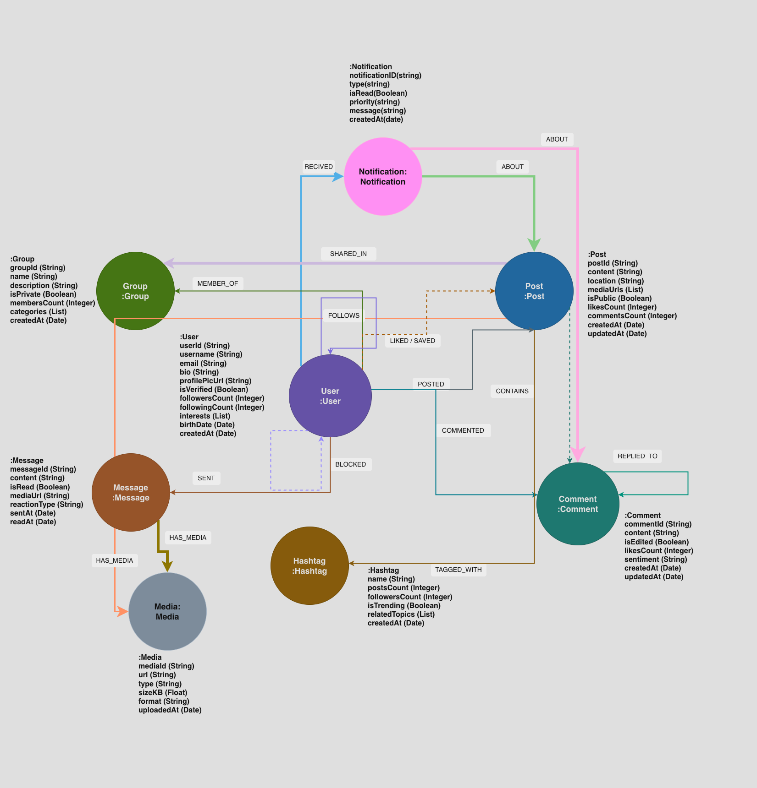

# Universidad del Valle de Guatemala

Facultad de Ingeniería  
Catedrático: Daniela Mesalles  
Sección: 20  
Base de Datos 2  
Proyecto 2  

# Red Social — Neo4j

## Integrantes

Joel Jaquez Carné: 23369  
Nery Molina Carné: 23218  
Luis Gonzalez Carné: 23353  

Guatemala, 21 de abril de 2026

---

# Avance 1: Caso de uso seleccionado

Se seleccionó el caso de uso Red social, ya que permite modelar múltiples interacciones entre usuarios, publicaciones, comentarios, mensajes, grupos y hashtags. Este caso cumple naturalmente con el requisito de trabajar con un grafo rico en conexiones, propiedades y relaciones diversas.

# Avance 2: Definición inicial de etiquetas de nodos

Hasta este punto se propone el uso de las siguientes etiquetas principales:

`:User`  
`:Post`  
`:Comment`  
`:Hashtag`  
`:Group`  
`:Message`  

Además, como expansión del modelo para hacerlo más robusto, se agregan:

`:Media`  
`:Notification`

---

# Avance 2.1: Diagrama del Grafo



Figura 1: Modelo del grafo de la red social en Neo4j

# Avance 3: Propiedades de nodos

`:User`

- `userId`: String
- `username`: String
- `email`: String
- `bio`: String
- `profilePicUrl`: String
- `isVerified`: Boolean
- `followersCount`: Integer
- `followingCount`: Integer
- `interests`: List<String>
- `birthDate`: Date
- `createdAt`: Date

`:Post`

- `postId`: String
- `content`: String
- `location`: String
- `mediaUrls`: List<String>
- `isPublic`: Boolean
- `likesCount`: Integer
- `commentsCount`: Integer
- `createdAt`: Date
- `updatedAt`: Date

`:Comment`

- `commentId`: String
- `content`: String
- `isEdited`: Boolean
- `likesCount`: Integer
- `sentiment`: String
- `createdAt`: Date
- `updatedAt`: Date

`:Hashtag`

- `name`: String
- `postsCount`: Integer
- `followersCount`: Integer
- `isTrending`: Boolean
- `relatedTopics`: List<String>
- `createdAt`: Date

`:Group`

- `groupId`: String
- `name`: String
- `description`: String
- `isPrivate`: Boolean
- `membersCount`: Integer
- `categories`: List<String>
- `createdAt`: Date

`:Message`

- `messageId`: String
- `content`: String
- `isRead`: Boolean
- `mediaUrl`: String
- `reactionType`: String
- `sentAt`: Date
- `readAt`: Date

`:Media`

- `mediaId`: String
- `url`: String
- `type`: String
- `sizeKB`: Float
- `format`: String
- `uploadedAt`: Date

`:Notification`

- `notificationId`: String
- `type`: String
- `isRead`: Boolean
- `priority`: String
- `message`: String
- `createdAt`: Date

# Avance 4: Relaciones del modelo

Las relaciones principales definidas son:

```cypher
(:User)-[:FOLLOWS]->(:User)
(:User)-[:BLOCKED]->(:User)
(:User)-[:MEMBER_OF]->(:Group)
(:User)-[:POSTED]->(:Post)
(:User)-[:LIKED]->(:Post)
(:User)-[:COMMENTED]->(:Comment)
(:User)-[:SENT]->(:Message)
(:Post)-[:TAGGED_WITH]->(:Hashtag)
(:Post)-[:CONTAINS]->(:Comment)
(:Comment)-[:REPLIED_TO]->(:Comment)
```

Relaciones extra para profundizar el modelo:

```cypher
(:Post)-[:HAS_MEDIA]->(:Media)
(:Message)-[:HAS_MEDIA]->(:Media)
(:User)-[:RECEIVED]->(:Notification)
(:Notification)-[:ABOUT]->(:Post)
(:Notification)-[:ABOUT]->(:Comment)
(:User)-[:SAVED]->(:Post)
(:Post)-[:SHARED_IN]->(:Group)
```

# Avance 5: Propiedades de relaciones

Cada relación tendrá al menos tres propiedades. Ejemplos:

`FOLLOWS(since: Date, notificationsEnabled: Boolean, mutualFriendsCount: Integer)`

`BLOCKED(blockedAt: Date, reason: String, isPermanent: Boolean)`

`MEMBER_OF(joinedAt: Date, role: String, contributionScore: Float)`

`POSTED(postedAt: Date, device: String, location: String)`

`LIKED(likedAt: Date, reactionType: String, isActive: Boolean)`

`COMMENTED(commentedAt: Date, isFirstComment: Boolean, device: String)`

`SENT(sentAt: Date, isEncrypted: Boolean, channel: String)`

`TAGGED_WITH(taggedAt: Date, relevanceScore: Float, isPrimary: Boolean)`

`CONTAINS(addedAt: Date, isVisible: Boolean, moderationStatus: String)`

`REPLIED_TO(repliedAt: Date, isDirectMention: Boolean, notifiedParent: Boolean)`

# Avance 6: Cobertura de tipos de datos

El modelo ya cubre todos los tipos requeridos:

String: username, content, role  
Integer: followersCount, likesCount, membersCount  
Float: relevanceScore, contributionScore, sizeKB  
Boolean: isVerified, isPublic, isRead  
List: interests, mediaUrls, categories, relatedTopics  
Date: createdAt, birthDate, sentAt, joinedAt

# Avance 7: Grafo conexo

El modelo fue pensado para que el grafo permanezca conexo. El nodo `:User` funciona como eje principal de conexión y enlaza con publicaciones, comentarios, grupos, mensajes y notificaciones. A su vez, los `:Post` conectan con `:Hashtag`, `:Comment` y `:Media`. Esto evita islas de información.

# Avance 8: Estrategia de carga masiva

Se planea usar archivos CSV para cargar usuarios, posts, comentarios, hashtags, grupos, mensajes y relaciones. La meta es superar los 5000 nodos combinando:

1200 usuarios  
1800 publicaciones  
1400 comentarios  
200 hashtags  
120 grupos  
500 mensajes  
300 archivos multimedia

# Avance 9: Operaciones CRUD a implementar

1. Crear nodos con una sola etiqueta.
2. Crear nodos con múltiples etiquetas.
3. Crear nodos con al menos cinco propiedades.
4. Consultar un nodo por identificador.
5. Consultar múltiples nodos con filtros.
6. Agregar propiedades a uno o varios nodos.
7. Actualizar propiedades de uno o varios nodos.
8. Eliminar propiedades de uno o varios nodos.
9. Crear relaciones con propiedades.
10. Actualizar y eliminar propiedades de relaciones.
11. Eliminar nodos.
12. Eliminar relaciones.

# Avance 10: Consultas Cypher para demostración

Se propone llegar a la presentación con estas consultas listas:

Usuarios con más seguidores.  
Publicaciones con más likes.  
Hashtags en tendencia.  
Grupos con más miembros.  
Comentarios con sentimiento negativo.  
Usuarios más activos por cantidad de publicaciones y comentarios.

# Avance 11: Extra sugerido

Como punto extra, el proyecto puede incluir un algoritmo de Graph Data Science, por ejemplo:

PageRank para identificar usuarios más influyentes.  
Node Similarity para sugerir amistades.  
Community Detection para detectar comunidades de usuarios.

# Conclusión

El proyecto ya tiene una base sólida para cumplir la rúbrica: supera el mínimo de etiquetas, define más de 10 tipos de relaciones, cubre todos los tipos de datos y plantea un grafo conexo. El siguiente paso es implementar la carga CSV, poblar AuraDB y construir las operaciones CRUD y consultas de demostración.
